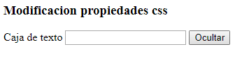
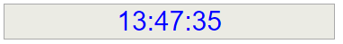
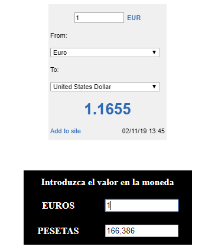
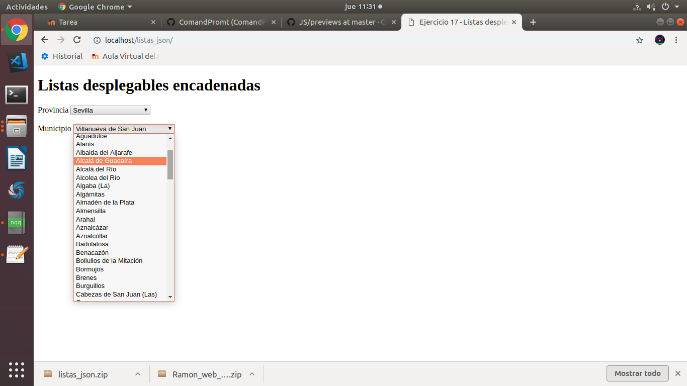
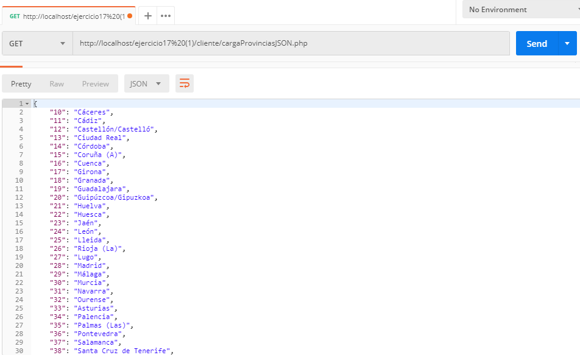
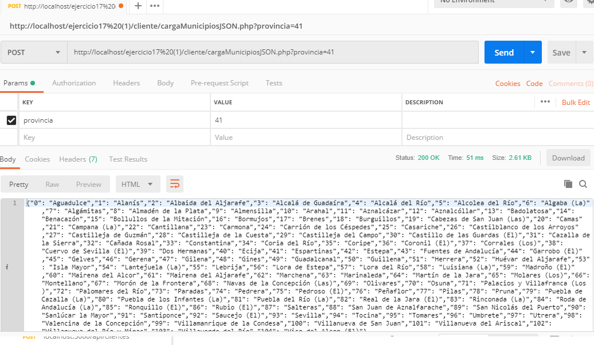

# Mostrar Datos de un archivo Json 
[Mostrar Json](https://github.com/ComandPromt/JS/tree/master/Mostar_datos%20json_js)

# Ejemplos de prompt (recoger datos por teclado)
[Ejemplo1](https://github.com/ComandPromt/JS/blob/master/ejemplo1-js.html)
[Ejemplo2](https://github.com/ComandPromt/JS/blob/master/ejemplo2-js.html)

# Calcular area del radio
[Calcular area del radio](https://github.com/ComandPromt/JS/blob/master/Areas.html)

# Mostrar/ocultar input

[Mostar/ocultar input](https://github.com/ComandPromt/JS/blob/master/mostrar_ocultar_input.html)

# Hora

[Hora en JS](https://github.com/ComandPromt/JS/blob/master/hora.html)

# Hora en titulo
[Hora en titulo](https://github.com/ComandPromt/JS/blob/master/hora_en_title.html)

# Funciones con arrays

[Funciones con arrays](https://github.com/ComandPromt/JS/tree/master/Arrays/Paises)

# Ejemplo de uso de tooltips

[Ejemplo de uso de tooltips](https://github.com/ComandPromt/JS/tree/master/Basic%20Tooltip)

# Efecto nieve

[Efecto de nieve](https://github.com/ComandPromt/JS/tree/master/Efecto_nieve)

# Conversor divisas

[Conversor de divisas](https://github.com/ComandPromt/JS/blob/master/conversor_divisas.html)

# Funcion copiarAlPortapapeles

~~~js 
function copiarAlPortapapeles(id_elemento) {

var textarea = document.getElementById(id_elemento);
textarea.select();
document.execCommand("copy");

}
~~~

# Funcion Recargar Pagina

~~~js
function recargar()
{
location.href=location.href
}
setInterval('recargar()',20000)
~~~

# Expresiones Regulares

## Comprobar matricula
[Comprobar matricula Ejemplo 1](https://github.com/ComandPromt/JS/blob/master/Comprobar%20matricula.html)
[Comprobar matricula Ejemplo 2](https://github.com/ComandPromt/JS/blob/master/Ejemplo_comprobar_matricula.html)

## Comprobar URL

~~~js
let url = /^(http|ftp|https)\:\/\/[a-z0-9\_-]+(\.[a-z0-9\_-]+)*(\:[0-9]{2,4})?$/;

document.write(url.test ('https://google.es:8080')+" "); //true            
document.write(url.test ('ftp://ftp.com.es')+" "); //true          
document.write(url.test ('file:///bin/bash')+" ");  //false            
document.write(url.test ('https://google.es/index.html')+" ");//false
~~~

## Ejemplo de validación de teléfono

~~~js
let telefono = /^[6789][0-9]{8}$/;

telefono.test ('123456789');  // false
telefono.test ( '95566622');  // false
telefono.test ('95566622a');  // false
telefono.test ('609123456');  // true
~~~

## Ejemplo de validación de código postal

[Ejemplo](https://github.com/ComandPromt/JS/blob/master/Ejemplo_comprobar_cod_postal.html)

~~~js
let codigoPostal = /^[0-9]{4,5}$/;

codigoPostal.test ( '14500');  // true
codigoPostal.test (  '9500');  // true
codigoPostal.test ('A11450');  // false
codigoPostal.test (     '1');  // false
~~~

## Ejemplo comprobar email

~~~js
    let email = /^[a-zA-Z0-9._-]+@[a-zA-Z0-9.-]+\.[a-zA-Z]{2,4}$/;

    email.test ('j.amj2000@gmail.com');            // true
    email.test ('pepe_lopez@ventas.tienda.com');  // true
    email.test ('pepe#lopez@tienda.com');         // false
    email.test ('pepe_lopez@ventas/tienda.com');  // false
~~~

## Contraseña segura

- Crea un programa que pida al usuario una propuesta de contraseña y
compruebe si cumple con los siguientes requisitos.

- Tiene entre 8 y 16 caracteres.

- Tiene una letra mayúscula.

- Tiene una letra minúscula.

- Tiene un número.

- Tiene uno de los siguientes valores: guión alto, guión bajo, arroba,
almohadilla, dólar, tanto por ciento o ampersand.

- Si cumple con todos los requisitos se considera una contraseña segura, de lo
contrario mostrará que es una contraseña no segura.

~~~js

~~~

# Array int to text UTF-8

~~~js

var test = new TextDecoder('utf-8');

var texto='216,175,217,132,217,138,217,132';
  
var cadena = texto.split(",");

var test2 = new Uint8Array(cadena);

console.log(test.decode(test2));

~~~

# Funciones con decimales

~~~js 

function dosDecimales(n) {

  let t=n.toString();
  let regex=/(\d*.\d{0,2})/;
  return t.match(regex)[0];
}

function trunc (x, posiciones = 0) {
  var s = x.toString()
  var l = s.length
  var decimalLength = s.indexOf('.') + 1

  if (l - decimalLength <= posiciones){
    return x
  }
  // Parte decimal del número
  var isNeg  = x < 0
  var decimal =  x % 1
  var entera  = isNeg ? Math.ceil(x) : Math.floor(x)
  // Parte decimal como número entero
  // Ejemplo: parte decimal = 0.77
  // decimalFormated = 0.77 * (10^posiciones)
  // si posiciones es 2 ==> 0.77 * 100
  // si posiciones es 3 ==> 0.77 * 1000
  var decimalFormated = Math.floor(
    Math.abs(decimal) * Math.pow(10, posiciones)
  )
  // Sustraemos del número original la parte decimal
  // y le sumamos la parte decimal que hemos formateado
  var finalNum = entera + 
    ((decimalFormated / Math.pow(10, posiciones))*(isNeg ? -1 : 1))
  
  return finalNum
}

function trunc2 (x, posiciones = 0) {
  var s = x.toString()
  var l = s.length
  var decimalLength = s.indexOf('.') + 1
  var numStr = s.substr(0, decimalLength + posiciones)
  return Number(numStr)
}

~~~

# Listas encadenadas JS

[Listas](https://github.com/ComandPromt/JS/tree/master/listas_json)
